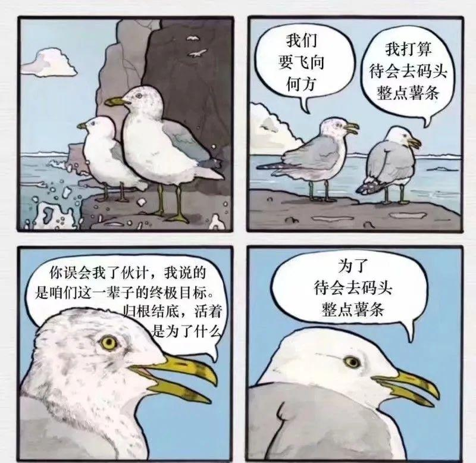

## 什么是薯条港？

为什么叫薯条港？薯条港这个名字来源于一幅漫画。

两只海鸥讨论人生终极目标，一只问我们飞向何方、活着为了什么。不管如何提问，另一只始终回答“去码头整点薯条”。

薯条港的灵感来自与此：**我们离终极目标太远，纠结只会浪费时间。我们离码头的薯条很近，不如先飞起来。**

## 同志，你好

这是最好的时代。

人类积攒了几千的财富，所有的知识、见识、智慧和艺术，是为我们准备的礼物。

这是最坏的时代。

帝国主义抬头，资本主义吃人。AI对世界造成巨大的冲击。我们正在迎来第四次工业革命。

世界处于百年未有至大变局。在这背景之下，我们成立了薯条港。

薯条港希望成为一种信任。

人们可以完全信任我们，可以闭着眼选择我们提供的产品与服务。

薯条港希望成为一个平台。

每一个想让世界更美好的人，可以在这里得到帮助，找到同伴。

薯条港希望成为一个信念。

每一个让世界更美好的梦想都可以实现，即使这个梦想很小、很小。

我们将对未来抱有美好期待的人称为梦想家，我们将志同道合之人成为同志。我们既是造梦人，我们也是追梦人。

人民是历史的创造者。同志，我们想和你一起创造历史。

## 文化和价值观

### 使命

和梦想家一起创造历史

### 愿景

每一个让世界更美好的梦想都可以实现。

### 价值观

- 潦草的开始胜过完美的准备。
- 今天胜过昨天，明天胜过今天。
- 不管白猫黑猫，捉到老鼠就是好猫。