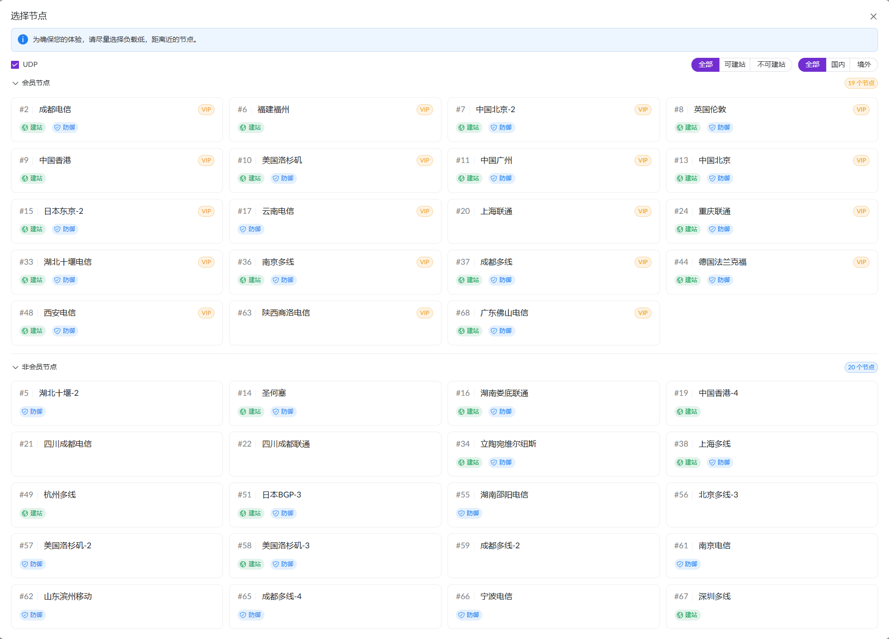
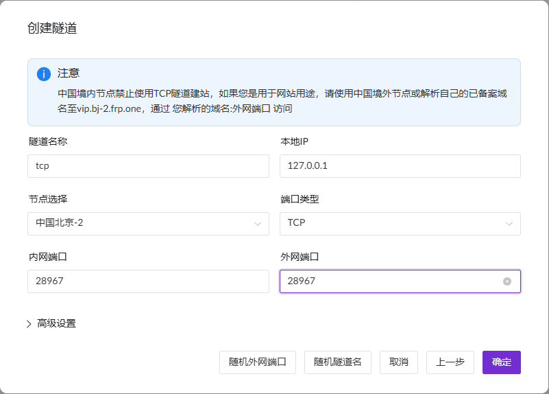
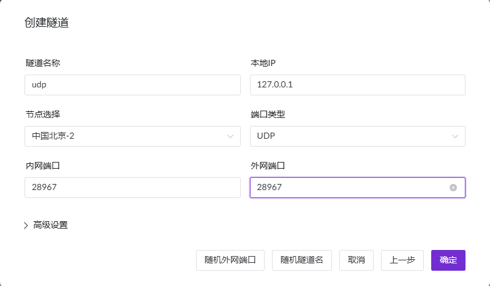

本文章和官方文档相辅相成，你仍然需要阅读[storj节点部署指南](https://storj.dev/node/get-started/setup)

## 序言

storj在中国是个非常冷门的项目，根据[storjnet.info](https://storjnet.info/)统计的信息，截至至写稿时(2025-12-24)中国大陆地区只有48个节点。


一部分原因是因为国内的商用带宽非常贵，因此产生了另一个利润更高的项目：PCDN

相比PCDN，Storj节点对硬件、带宽的要求都很低，也不会产生被运营商严打的流量特征，如果你想学习Linux、计算机网络、加密货币等交叉领域知识，Storj是一个不错的项目。

### 收益

特别说明一下：Storj项目更推荐利用手头多余的零件、设备来运行节点。不要专门为了运行节点而进行大额投入，这项目利润真的很低。

截至2025年12月24日的利率
- 存储容量(每TB/每月): $1.50
- 出口流量(每TB): $2.00
- 审核/修复(每TB): $2.00

### 推荐

- 每个存储节点进程使用一个处理器核心
- 每个存储节点进程使用一块硬盘。不支持 SMR。连接硬盘时无需 RAID 控制器，或者将 RAID 控制器配置为直通/IT 模式。
- 每个存储节点进程有 2 TB 可用空间
- 每 TB 存储节点容量每月 1.5 TB 的传输流量；无限制优先
每 TB 容量 3Mbps 上传带宽
每 TB 容量 5Mbps 下载带宽
每月正常运行时间（在线和运营）达到 99.5%。


### 最低

- 每个存储节点进程使用一个处理器核心
- 每个存储节点进程使用一块硬盘。不支持 SMR。连接硬盘时无需 RAID 控制器，或者将 RAID 控制器配置为直通/IT 模式。
- 每个存储节点进程有 500 GB 的可用空间
- 每 TB 存储节点容量每月传输 1.5 TB 数据
- 每 TB 容量 1Mbps 上传带宽
- 每 TB 容量 3Mbps 下载带宽
- 每月正常运行时间（在线和运营）为 99.3%，每月最大总停机时间为 5 小时。

## 外部端口

客户需要一个外部的ip和端口来访问你的节点。如果你可以要求三大运营商提供公网ipv6，那么可以按照官方的教程操作。

如果你无法提供公网ip，我提供另一种方法：内网穿透(Intranet Penetration)技术。

这是一种让内网设备被外网设备直接访问的技术，本质是打通内网与外网的通信链路。
1.  内网设备主动连接穿透服务器有公网IP
2.  穿透服务器给内网设备分配公网访问标识（域名+端口）
3.  外网设备访问该标识，穿透服务器转发请求到对应内网设备

你可以选择下面的方案(下面的链接为价目表)：

- [frp](https://gofrp.org/zh-cn/docs/overview/): 可以自己在拥有公网IP的VPS上部署，也可以找服务商托管的frp服务。
- [ngrok](https://ngrok.com/pricing): 老牌隧穿
- Cloudflare Tunnel: 无法转发UDP，但仍然可以用。
- [花生壳](https://hsk.oray.com/price#personal): 垃圾，不推荐，又贵又限速又限流量。
- [zerotail](https://www.zerotier.com/pricing/)

我使用的是frp托管商[chmlfrp](https://www.chmlfrp.net/#dingjia)，它们提供无限流量，以及较为宽松的带宽限制：国际128M，国内32M。

### 配置隧道

你可以完全照抄我的配置，也可以自己适当修改。

添加隧道，选择可以提供UDP的节点。



分别添加两条隧道，需要相同的内部端口和相同的外部端口，分别选择tcp和udp协议。





生成你的frpc配置表，类似下面这种：

```ini
[common]
server_addr = <ip>
server_port = <port>
tls_enable = false
user = <user>
token = <token>

[storj_tcp]
type = tcp
local_ip = 127.0.0.1
local_port = 28967
remote_port = 28967

[storj_udp]
type = udp
local_ip = 127.0.0.1
local_port = 28967
remote_port = 28967
```

将文件放到`/opt/frp/storj.ini`。

### 安装软件

可以在[GitHub releases](https://github.com/fatedier/frp/releases)下载软件包，解压后将frpc放入`/usr/local/bin`下，这样bash可以在全局识别frpc为命令了。

添加systemd服务，由systemd来管理服务的运行。使用文本编辑器 (如 nano) 在 `/etc/systemd/system` 目录下创建一个 storj.service 文件，用于配置专门为 storj 提供隧穿的frpc服务。官网的[安装教程](https://gofrp.org/zh-cn/docs/setup/systemd/)只给了frps的配置，你可以参考我的来进行配置。

```ini
[Unit]
Description=FRP Client
After=NetworkManager-wait-online.service
Wants=NetworkManager-wait-online.service

[Service]
Type=simple
# 启动frps的命令，需修改为您的frpc的安装路径
ExecStart = /usr/local/bin/frpc -c /opt/frp/storj.ini
Restart=always
RestartSec=5
[Install]
WantedBy=multi-user.target
```

你可能因为系统不同，需要修改为`network-online.target`以保证网络联通后启动frp，具体操作问ai。

```bash
# 启动frp
sudo systemctl start storj
# 停止frp
sudo systemctl stop storj
# 重启frp
sudo systemctl restart storj
# 查看frp状态
sudo systemctl status storj
# 设置开机自启
sudo systemctl enable storj
```

## docker加速

接下来跟着官方教程完成步骤3-5，你可能会遇到docker无法从docker hub拉去镜像的问题。

修改docker守护进程的配置文件，添加镜像仓库以加速。如果为空就创建一个并保存。

```bash
sudo nano /etc/docker/daemon.json
```

添加下面的内容，如果你有其他的镜像也可以自行替换。

```json
{
  "registry-mirrors": [
    "https://docker.1panel.live",
    "https://dockerpull.cn"
  ]
}
```

重启docker进程

```bash
sudo systemctl daemon-reload
sudo systemctl restart docker
```

## 代理
国内无法直接访问storj的卫星集群，因此无法签到。我们使用代理(proxy)技术。你也可以使用VPN。

需要在服务器上部署代理软件，下面这些项目比较出名，从中选一个：

- mihomo (clash meta)
- v2ray
- sing-box

我选择的是基于v2ray的web应用：v2rayA。

使用docker安装，可以参考[官方docker安装文档](https://v2raya.org/docs/prologue/installation/docker/)

```bash
docker run -d \
  --restart=always \
  --privileged \
  --network=host \
  --name v2raya \
  -e V2RAYA_LOG_FILE=/tmp/v2raya.log \
  -e V2RAYA_V2RAY_BIN=/usr/local/bin/v2ray \
  -e V2RAYA_NFTABLES_SUPPORT=off \
  -e IPTABLES_MODE=legacy \
  -v /lib/modules:/lib/modules:ro \
  -v /etc/resolv.conf:/etc/resolv.conf \
  -v /etc/v2raya:/etc/v2raya \
  mzz2017/v2raya
```

登录后进入设置，完成以下设置
- 透明代理: 启用，分流规则与规则端口一致
- 透明代理实现方法: system tun
- 规则端口的分流模式: RoutingA
- 防止DNS污染: 转发DNS请求

然后配置RoutingA列表。我的节点好像有点问题，有时候会连不上，所以重复写了很多了规则来饱和式匹配域名，具体语法参见[RoutingA规则](https://v2raya.org/docs/manual/routinga/)。

```text
default: direct
domain(us1.storj.io) -> proxy
domain(eu1.storj.io) -> proxy
domain(ap1.storj.io) -> proxy
domain(domain:storj.io) -> proxy
port(7777)->proxy
domain(docker.io)->proxy
domain(github.com) -> proxy
domain(debian.org)->proxy
```

查看容器的log输出，如果出现这些INFO日志，且没有ERROR，代表正常工作。

```log
2025-12-21T15:18:24Z	INFO	Current binary version	{"Process": "storagenode-updater", "Service": "storagenode", "Version": "v1.142.7"}
2025-12-21T15:18:24Z	INFO	Version is up to date	{"Process": "storagenode-updater", "Service": "storagenode"}
2025-12-21T15:18:24Z	INFO	Current binary version	{"Process": "storagenode-updater", "Service": "storagenode-updater", "Version": "v1.142.7"}
2025-12-21T15:18:24Z	INFO	Version is up to date	{"Process": "storagenode-updater", "Service": "storagenode-updater"}
2025-12-21T15:18:59Z	INFO	piecestore	uploaded	{"Process": "storagenode", "Piece ID": "BNERV6D3IQGORXMICYMR6FGFMLOVV6MUB3XMM6IRXDJBVDPJZ2KQ", "Satellite ID": "12EayRS2V1kEsWESU9QMRseFhdxYxKicsiFmxrsLZHeLUtdps3S", "Action": "PUT", "Remote Address": "172.17.0.1:41080", "Size": 32512}
2025-12-21T15:21:09Z	INFO	piecestore	downloaded	{"Process": "storagenode", "Piece ID": "QHDD2YN7WG7JNBOFX3PJZ5FZQM423KWU3JLHML5KRFWCNAO7MRJQ", "Satellite ID": "1wFTAgs9DP5RSnCqKV1eLf6N9wtk4EAtmN5DpSxcs8EjT69tGE", "Action": "GET_AUDIT", "Offset": 758272, "Size": 256, "Remote Address": "172.17.0.1:41318"}
2025-12-21T15:23:00Z	INFO	piecestore	download canceled	{"Process": "storagenode", "Piece ID": "G55JQHFQYHGF63SEVF2Y2WE3IX62NLD7LSHDRQR52TRKQCOSTJ4Q", "Satellite ID": "12EayRS2V1kEsWESU9QMRseFhdxYxKicsiFmxrsLZHeLUtdps3S", "Action": "GET", "Offset": 0, "Size": 7936, "Remote Address": "172.17.0.1:48620", "reason": "downloaded size (0 bytes) does not match received message size (7936 bytes)"}
2025-12-21T15:43:38Z	INFO	piecestore	upload canceled	{"Process": "storagenode", "Piece ID": "VKEVYEKTPFUNEGQWKX56S4QILEOXOQFE7IZMGZS2TVPPIQRPN5UQ", "Satellite ID": "12EayRS2V1kEsWESU9QMRseFhdxYxKicsiFmxrsLZHeLUtdps3S", "Action": "PUT", "Remote Address": "172.17.0.1:53694", "Size": 2293760}
2025-12-21T15:19:03Z	INFO	orders	finished	{"Process": "storagenode", "satelliteID": "1wFTAgs9DP5RSnCqKV1eLf6N9wtk4EAtmN5DpSxcs8EjT69tGE", "count": 13}
2025-12-21T15:19:03Z	INFO	orders	finished	{"Process": "storagenode", "satelliteID": "12L9ZFwhzVpuEKMUNUqkaTLGzwY9G24tbiigLiXpmZWKwmcNDDs", "count": 118}
2025-12-21T15:19:03Z	INFO	orders	finished	{"Process": "storagenode", "satelliteID": "121RTSDpyNZVcEU84Ticf2L1ntiuUimbWgfATz21tuvgk3vzoA6", "count": 63}
2025-12-21T15:19:03Z	INFO	orders	finished	{"Process": "storagenode", "satelliteID": "12EayRS2V1kEsWESU9QMRseFhdxYxKicsiFmxrsLZHeLUtdps3S", "count": 461}
```

版本检查大约10分钟进行一次，`piecestore	uploaded`为用户上传数据到你的硬盘。`piecestore downloaded`为用户从你的硬盘下载数据。`piecestore download canceled`为取消下载，可能你距离客户太远竞争不过其他节点，也可能是用户主动中断。`piecestore upload canceled`为中断上传。`orders finished`为你向卫星集群提交你的节点完成的订单量。

## 后续提现等操作

从欧易提现？欢迎用我的邀请码注册账号：`81522149`。非常感谢！

如果本文对你有帮助的话也欢迎给我一点打赏：`0x5deab148f542cab91574a6be1b641788703ed712`

## 交流群

matrix: #cn_storj_sno:mozilla.org

QQ群: 300842907


